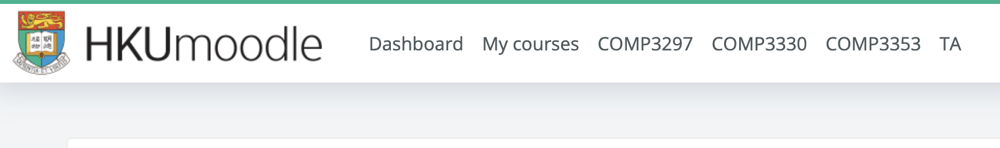

# Moodle Cleaner

This project aims to resolve currently terrible UX of HKU Moodle page. Currently there is no method for user to adjust the contents of the page without resorting to JavaScript plug-in.

Some examples include:

1. Cannot hide courses of the past semesters.
2. Cannot change the order of the courses or how they are rendered, and there is no pattern to help users to quickly locate a wanted course as the list is not sorted.
3. No hyperlinks to other course pages if the user is not at https://moodle.hku.hk. Users have to go back to the root page to select which course to go to.

# How to use Moodle Cleaner?

For v1.0.0, Moodle Cleaner provides basic custom filter configurations that fit most use cases.

## Sorting

The course list is now sorted in lexicographic order under all cases.

## Filtering by academic year and semester

User can filter the courses they want to see by providing which (academic) year and which semester of courses to render. They can also provide course code prefixes such as `COMP` or `FINA`. If both `year` and `sem` are not provided, or only `sem` is provided, no filtering is performed.

If user only provides `year`, the Cleaner looks for the course text that has `year` inside. For example, if user enters 2024, "COMP3297 Software engineering [Section 1A, 2024]" will be selected.

If user provides both `year` and `sem`, the Cleaner looks for the pattern "Section \<sem\>X, \<year\>" to match. Only semester 1 and 2 are now supported.

## Filtering by course (title) prefixes

User can enter the prefixes they want to see by entering prefixes, delimited by semi-colons (;). For example, if the user only wants to see ECON and FINA level 3 courses, they should type in `FINA3; ECON`. If the user leaves this blank, the Cleaner does nothing.

## Some courses not being picked up or want to include some other utility moodle page?

User can provide texts (substrings) that exist in the course title, the Cleaner will look for the strings and keep them on the page. Users need to provide a (ideally short) text to as the identifier of the course, which will be used as the text of the navigation button on the nav bar. (See next section for this feature)

## Hyperlinks on the nav bar

If the user provides both year and sem params, corresponding hyperlinks to the filtered courses will be rendered on the top nav bar. Whenever users stay on `moodle.hku.hk` webpages, users can directly navigate to other pages without going back to home.

## Cloud Sync

The user configuration will be saved to cloud linked to your Google account, and will be synced across devices logged in with the same Google account. Therefore even when the user is not logged in with their Moodle account, they can still click on the button => redirect to authenticate => land on the course page they want.

## Screenshots

# Privacy Policy

The project is open-source so the reviewers or anyone one can see the implementation of the extension.

## What type of data we collected?

The only data that is being used is the course list when the user stays on the Moodle home page, and the data will be handled by converting necessary information to json as the format to be saved. The course data, along with the parameters typed in the popup, will be saved to the cloud storage to create HTML elements, and is not sent to other server for external uses.

# Updates

_Sep. 1_

[HKU Moodle Helper](https://chromewebstore.google.com/detail/hku-moodle-helper/einenigpmpgopefpkfbmnlcjmoamijap) deployed a newer version recently, which allowed users to pin the courses in the home page to the top for quicker search. However, this extension is not compatible with Moodle Cleaner.

_Aug. 18_

HKU ITS removes the side bar navigation hyperlinks to other course pages in all `moodle.hku.hk/*` pages. Originally, the sidebar was used to fetch desired data, including course names and links to individual pages. The major features of this extension all rely on these. This also kills another extension called [HKU Moodle Helper](https://chromewebstore.google.com/detail/hku-moodle-helper/einenigpmpgopefpkfbmnlcjmoamijap).

## Progress

The build has been submitted for review, awaiting approval.

## Pull Requests

Welcome

## Your Support

You can choose to make a small donation via [Buy Me a Coffee](https://buymeacoffee.com/hengyuli90j). Your support can help the developer of this extension closer to more NewJeans & aespa concerts in the future!!!!!!
