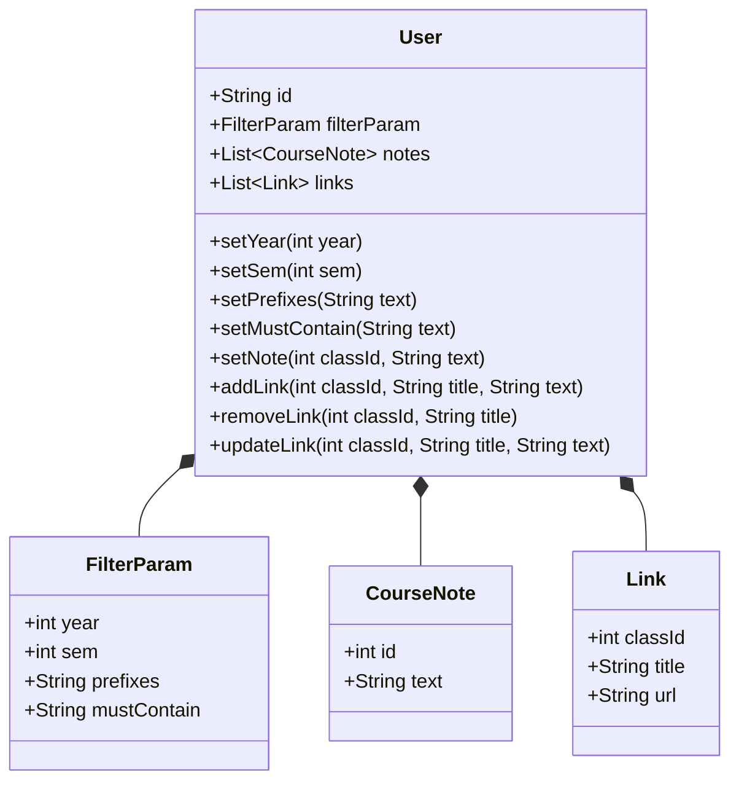

```mermaid
classDiagram
    class FilterParam {
        +int year
        +int sem
        +String prefixes
        +String mustContain
    }

    class CourseNote {
        +int id
        +String text
    }

    class Link {
        +int classId
        +String title
        +String url
    }

    class User {
        +String id
        +FilterParam filterParam
        +List~CourseNote~ notes
        +List~Link~ links

        +setYear(int year)
        +setSem(int sem)
        +setPrefixes(String text)
        +setMustContain(String text)
        +setNote(int classId, String text)
        +addLink(int classId, String title, String text)
        +removeLink(int classId, String title)
        +updateLink(int classId, String title, String text)
    }

    User *-- FilterParam
    User *-- CourseNote
    User *-- Link
```

Note: The `User` class is not explicitly implemented as the user data does not need to be all loaded to popup.
